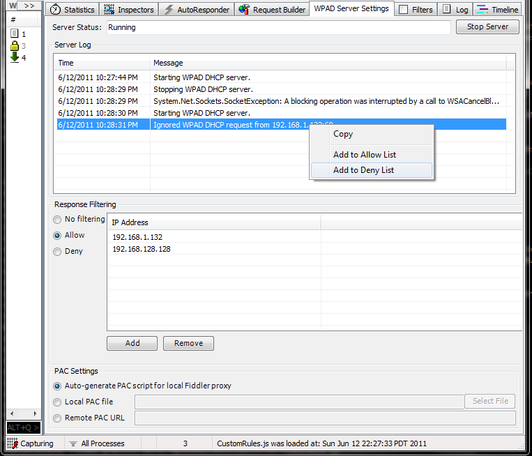

# WpadServerFiddlerExtension
Run a WPAD DHCP server as a Fiddler extension that instructions clients to use Fiddler as their proxy.

## About WPAD Server Fiddler Extension
The WPAD Server Fiddler Extension runs a WPAD (Web Proxy Auto Discovery) DHCP server.  When web browsers that use WPAD (like Internet Explorer) attempt to auto discover their HTTP proxy server the WPAD Server Fiddler Extension will respond.  You can configure the extension to point web browsers toward the local Fiddler instance or other proxies.

## Use
By default, after installation the WPAD server is not running when Fiddler starts and responds only to the local machine.  There's a WPAD Server Settings tab listed in Fiddler's set of extension  tabs in which you can change the following options:
* Start/stop the WPAD server using the "Start/Stop Server" button.  When Fiddler starts the WPAD server is started only if it was running when Fiddler was last closed or just after install.
* Change the PAC Settings option to change what PAC file clients obtain:
  * Auto-generate PAC script for local Fiddler proxy: The extension will generate a PAC file that will have clients connect to the local Fiddler instance.
  * Local PAC file: Select a local PAC file to serve to clients
  * Remote PAC URL: Enter a URL to give to clients telling them where to find the PAC file.
* Change the Response Filtering to select what clients to serve to:
  * No filtering: Serve to all clients
  * Allow: Serve to only those clients listed in the IP Address list.
  * Deny: Serve to all clients except those listed in the IP Address list.
* You can add and remove entries from the IP Address list via the add and remove button and by right clicking on an entry in the Server Log to add a mentioned IP address.
* The Server Log lists start and stop messages and notes when ignoring or responding to a WPAD request.
    
## Known Design Issues 
* If on a network with a DHCP server the WPAD server will have to race the network's DHCP server to respond to the client and may not win.
* Only uses DHCPv4. IPv6 not supported.

## Install
An [installer](https://deletethis.net/dave/wpadserverfiddlerextension/WpadServerFiddlerExtension.exe) is available if you don't want to build from source.

## Screenshot

